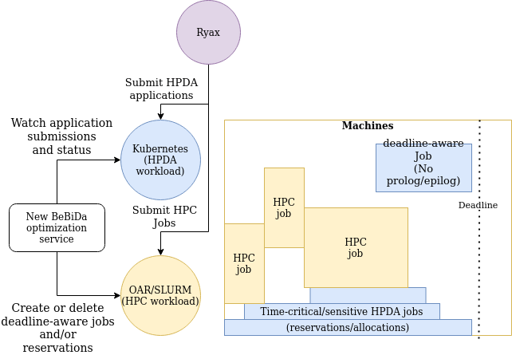

# BeBiDa Optimization Service

This repository provides the BeBiDa optimizations to improve Big Data jobs turnaround time through adapted mechanisms which offer better guarantees. Our goal is to bring more elasticity in HPC platforms, in order to allow Big Data jobs (Spark) to be executed dynamically, but without altering its resource manager’s internal aspects or losing in scheduling efficiency. We are convinced that each scheduling mode (HPC and Big Data) have their own advantages and disadvantages and they fit better to serve the needs of their typical use cases hence we do not want to change internals of any of them. For that, we focus in extending the BeBiDa techniques that enable the HPC and Big Data resource and job management systems to collocate with minimal interference on the HPC side, with **acceptable and high guarantees** for the Big Data jobs executions.

We can use two mechanisms to improve BeBiDa guarantees: 1) deadline-aware and 2) time-critical. These two approaches are complementary will be combined.

## Deadline-aware
In this technique we create empty jobs which do not trigger the prolog/epilog to leave room for applications. Hence we prepare holes on the HPC schedule plan to guarantee a fixed pool of resources for the Big Data workload. The main issue is when to trigger these jobs and with how many resources and time.

## Time-critical
In this technique we will use a dynamic set of resources to serve applications immediately and scale them out and in (grow and shrink) when necessary. Again, the main issue is when to add or remove nodes from the on-demande pool. For this we will make use of advanced reservations.

The following figure sketches the design of executing jobs using the new BeBiDa deadline-aware and time-critical techniques through the usage of RYAX workflow engine.

<!---

-->

<figure>
  
  <figcaption>MDN Logo</figcaption>
</figure>

 
